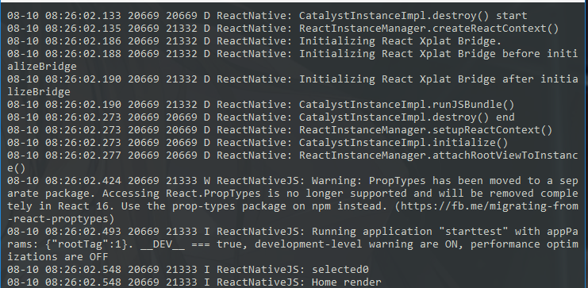
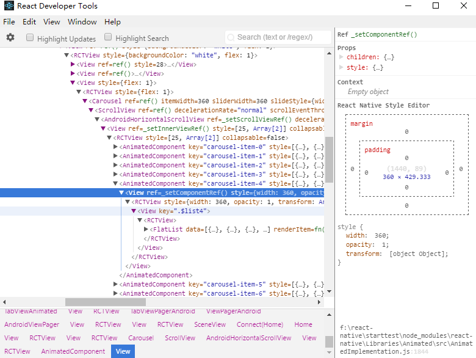
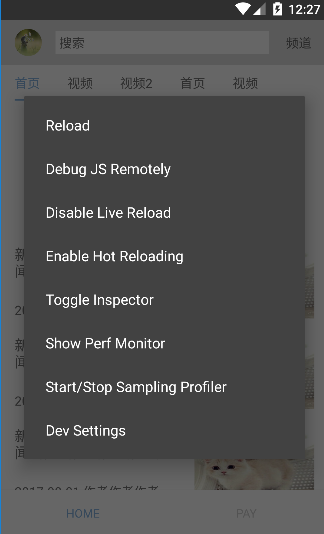
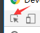

## reanct-native 介绍
### 简介
React Native 就是用 JavaScript 代码写 android 和 ios 原生应用。即 learn once, write anywhere
### 技术栈
1. js、html、css
2. [ECMAScript6](https://wohugb.gitbooks.io/ecmascript-6/content/docs/intro.html)
3. [React 框架](https://discountry.github.io/react/tutorial/tutorial.html)
4. [redux 状态管理器](http://cn.redux.js.org)
5. [react-native](http://reactnative.cn/docs/0.47/getting-started.html)
6. 对 android 和 ios 开发的简单了解
### 开发环境
参照 [react-native 搭建开发环境](http://reactnative.cn/docs/0.47/getting-started.html)            
1. 下载 python2、node 并安装 **(不能是python3)**        
2. 通过 npm 安装 yarn，之后可以用 `yarn add` 代替 `npm install --save`      
3. 安装 React Native 的命令行工具 `yarn add react-native-cli`        
4. 安装 android studio 并配置 **(android studio 的配置必须严格按照 RN 官网来，没有让勾的不能勾，否则无法运行)**        
5. 配置 android 环境变量      
6. `react-native init projectname` 初始化项目
### 开发准备
1. 编辑器
2. 模拟器。可以用 android studio 自带的，也可以用 [genymotion](https://www.genymotion.com/account/login/)
3. 使用 `react-native run-android` 或者 `react-native run-ios`命令，用于打包生成安装包并在模拟器上运行
    - 通过 `adb devices` 查看目前有几个模拟器，同时只能有一个存在
    - cannot delete path ... 错误可通过 `cd android && gradlew.bat clean` 解决
4. 使用 `react-native log-android` 打印日志，输出程序中的 `console.log()` **( `console.log()` 会严重影响性能 )**

    

log-android 效果图

      
5. `npm install -g react-devtools` 安装调试工具，`react-devtools` 运行该工具，用于查看内部的 dom 结构

    

react-devtools

      
6. 模拟器按 `Ctrl + m` 或者摇晃真机呼出开发者选项，可进行设置

    

开发者菜单

      
    - `reload` 重新加载，相当于F5
    - `debug js remotely`，相当于f12，可以断点调试
    - `live reload`，相当于实时F5
    - `hot reloading`，热加载，相当于局部刷新，会保留之前的状态
    - `toggle inspector`，相当于 
    - `show perf monitor` 开启硬件信息，如fps等
7. 关于使用 chrom 调试程序。
在开发者选项中点击 `debug js romotely` 即可在 chrome 中开启控制台。相关使用方法可以参照[如何通过 Chrome 调试 React Native 程序](https://github.com/crazycodeboy/RNStudyNotes/blob/master/React%20Native%E8%B0%83%E8%AF%95%E6%8A%80%E5%B7%A7%E4%B8%8E%E5%BF%83%E5%BE%97/React%20Native%E8%B0%83%E8%AF%95%E6%8A%80%E5%B7%A7%E4%B8%8E%E5%BF%83%E5%BE%97.md#如何通过-chrome调试react-native程序)
    - 开启控制台之后 reload 可能会导致 app 闪退，重新开启 app 即可
    - 开启控制台会导致 `log-android` 查看 log 的方法失效，`console.log()` 会输出到控制台的 console 中
            
可以开始敲代码了~