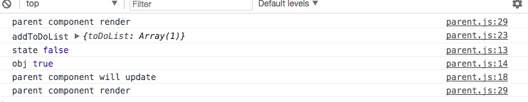
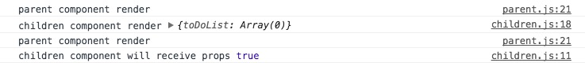
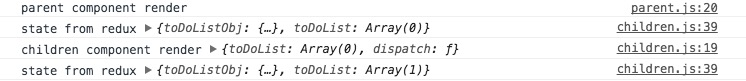
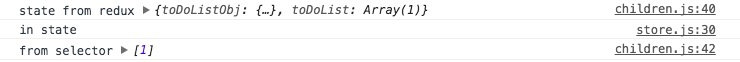

react 本身更新数组和对象，类似于 array.push() 时，是否重新渲染组件呢？   
react + redux 呢？    
react + redux + reselector 呢？   
## react
### 更新 state
因 `react component` 更新状态的方式为 `this.setState()`, 所以每次都会重新渲染，不过不改变引用的情况下，新老状态值会保持一致
```javascript
  class Parent extends Component {
    constructor() {
      super();
      this.state = {
        toDoListObj: {
          toDoList: []
        }
      }
    }
    shouldComponentUpdate(nextProps, nextState) {
      console.log(this.state.toDoListObj === nextState.toDoListObj);
    }
    componentWillUpdate() {
      console.log('parent component will update');
    }
    addToDoList() {
      const { toDoListObj } = this.state;
      toDoListObj.toDoList.push('1');
      console.log('addToDoList', toDoListObj);
      this.setState({
        toDoListObj
      })
    }
    render() {
      console.log('parent component render');
      return (
        <div >
          <h3> Parent </h3>
          <button
            onClick={this.addToDoList.bind(this)}
          >add</button>
          <div>
            {
              this.state.toDoListObj.toDoList.map(
                item => (
                  <span>item</span>
                )
              )
            }
          </div>
        </div>
      );
    }
  }

  export default Parent;

```
<div  align="center">    
  
</div>
### prop 更新
当 `children component` 为 `PureComponent` 时，父组件状态修改但不更改引用，父组件重新渲染，子组件会执行 `componentWillReceiveProps` 但不会重新渲染，但是这个时候 `setState({state: newState})` 会重新渲染。
```javascript
  import React, { PureComponent } from 'react';

  class Children extends PureComponent {
    constructor(props) {
      super(props);
      this.state = {
        toDoList: this.props.toDoList
      }
    }
    componentWillReceiveProps(nextProps) {
      console.log('children component will receive props',
      this.props.toDoList === nextProps.toDoList);
      this.setState({
        toDoList: nextProps.toDoList
      })
    }
    render() {
      console.log('children component render', this.props);
      return (
        <div >
          <h3> Children </h3>
          <div>
            {
              this.state.toDoList.map(
                (item, index) => (
                  <span key={index}>{ item }</span>
                )
              )
            }
          </div>
        </div>
      );
    }
  }

  export default Children;
```   
<div  align="center">    
  
</div>
## react + redux
redux 状态更新之后，会执行所有的 `mapStateToProps`，然后浅比较更新前后的 `props` 是否一致， 如果一致，那么就不更新组件( `componentWillReceiveProps` 也不会执行 )。
```javascript
import React, { Component } from 'react';
import { connect } from 'react-redux';

class Children extends Component {
constructor(props) {
  super(props);
  this.state = {
    toDoList: this.props.toDoList
  }
}
componentWillReceiveProps(nextProps) {
  console.log('children component will receive props',
  this.props.toDoList === nextProps.toDoList);
  this.setState({
    toDoList: nextProps.toDoList
  })
}
render() {
  console.log('children component render', this.props);
  return (
    <div >
      <h3> Children </h3>
      <div>
        {
          this.state.toDoList.map(
            (item, index) => (
              <span key={index}>{ item }</span>
            )
          )
        }
      </div>
    </div>
  );
}
}

export default connect(
state => {
  console.log('state from redux', state);
  return {
    toDoList: state.toDoList
  }
}
)(Children);

```   
<div  align="center">    
  
</div>

### react + redux + reselector
当 `redux state` 改变，会执行所有的 `mapStateToProps`，执行 `createSelector` 中的 `state array`，这里面的值没有改变时，直接返回上次的值，如果更新，执行 `selector`， 然后 `redux` 会再进行一次检查。
```javascript
export const getToDoList = createSelector(
  [state => {
    console.log('in state');
    return state.toDoList;
  }],
  toDoList => {
    console.log('in selector');
    return toDoList;
  }
)
// in Children component
export default connect(
  state => {
    console.log('state from redux', state);
    let toDoList = getToDoList(state);
    console.log('from selector', toDoList);
    return {
      toDoList
    }
  }
)(Children);
```
<div  align="center">    
  
</div>

*** P.S.I 一句话总结：`react` 中所有的检查均为浅检查，即仅检查指针是否改变（标准的 js 检查） ***
## Vue 相关总结
vue 采用 `observer` (观察者模式) 的方式决定是否渲染组件。
1. 遍历 `data` 和 `vuex state` 并为每个定义好的值添加 `observer` (即使是嵌套也添加)。
2. 当有 `observer` 的值改变时，重新渲染组件。
3. 执行到 `computed` 和 `getters` 的时候，用到哪个变量(即执行某个变量的 `get()` )，就往他的 `observer` 中注册事件，当此变量变化时，再重新执行 `computed` 和 `getters`(此过程为根据现象推测)。
4. vue 组件默认为类似 `PureComponent`。
